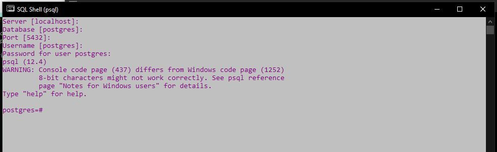
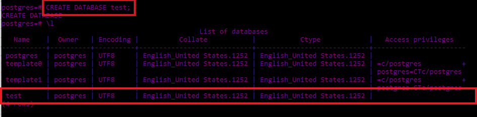

# Hi , I am learning PostgreSQL

_Brillianr Research Team_

## Table of contents
* [Introduction](#intro)
* [Installation](#installation)

## Introduction  
#### What is Database?
A database is an organized collection of data, generally stored and accessed electronically from a computer system. Where databases are more complex they are often developed using formal design and modeling techniques.
#### What is DBMS?
A Database Management System (DBMS) is software designed to store, retrieve, define, and manage data in a database.
#### What is RDBMS?
A relational database is a digital database based on the relational model of data, as proposed by E. F. Codd in 1970.[1] A software system used to maintain relational databases is a relational database management system (RDBMS).
#### What is PostgreSQL?
PostgreSQLalso known as Postgres, is a free and open-source relational database management system (RDBMS) emphasizing extensibility and SQL compliance. 

## Installation  
You can download  PostgresSQL for Windows form [here](https://www.enterprisedb.com/downloads/postgres-postgresql-downloads).
You can follow this installation [guide](https://github.com/silenthunter007/postgresql).

## Getting Started

#### How to run PostgreSQL?
After installation open the SQL Shell(psql) which is the command line terminal for PostgreSQL.Follow the following command: 

`Server [localhost]:`   > press Enter

`Database [postgres]:`  > press Enter

`Port [5432]:`> press Enter

`Username [postgres]:` > press Enter

`Password for user postgres:` > Enter your password

the PostgreSQL shall be up and running.

## Commands for psql

| Function              | Command |
|-----------------------|---------|
| Help                  | help    |
| Help for SQL command  | \h      |
| Help for PSQL command | \\?     |
| Quit                  | \q      |
| List of Database      | \l      |

## Create a Database

Command : `CREATE DATABASE DATABASE_NAME`

Example: 
