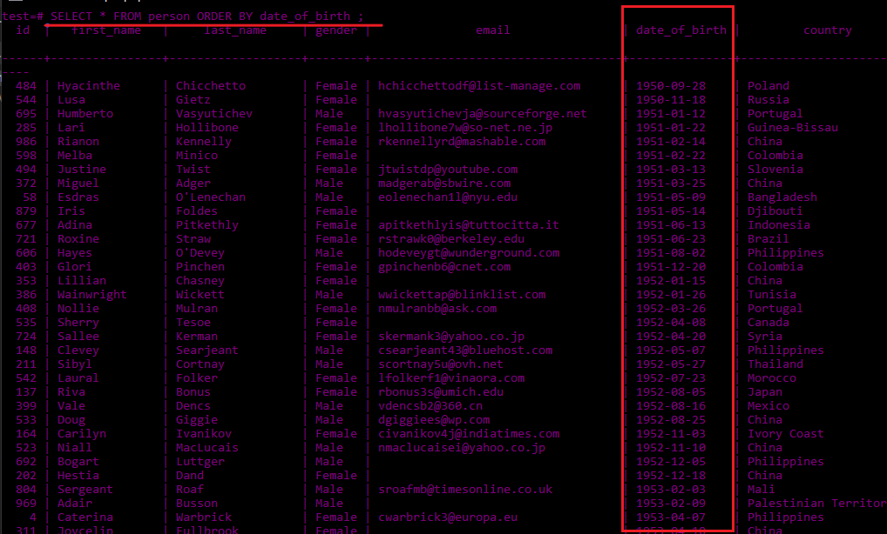

# Hi , I am learning PostgreSQL


_Brilliant Research Team_

## Table of contents
* [Introduction](#intro)
* [Installation](#installation)
* [Database Operation](#db)
    * [Create Database](#db1)
    * [Connect Database](#db2)
    * [Delete Database](#db3)
    * [Create Table in Database](#db4)

## Introduction  <a name="intro"></a>
#### *What is Database?*
A database is an organized collection of data, generally stored and accessed electronically from a computer system. Where databases are more complex they are often developed using formal design and modeling techniques.
#### *What is DBMS?*
A Database Management System (DBMS) is software designed to store, retrieve, define, and manage data in a database.
#### *What is RDBMS?*
A relational database is a digital database based on the relational model of data, as proposed by E. F. Codd in 1970.[1] A software system used to maintain relational databases is a relational database management system (RDBMS).
#### *What is PostgreSQL?*
PostgreSQLalso known as Postgres, is a free and open-source relational database management system (RDBMS) emphasizing extensibility and SQL compliance. 

## Installation  <a name="installation"></a>
[x] You can download  PostgresSQL for Windows form [here](https://www.enterprisedb.com/downloads/postgres-postgresql-downloads).
You can follow this installation [guide](https://github.com/silenthunter007/postgresql).

## Getting Started

### How to run PostgreSQL?
After installation open the SQL Shell(psql) which is the command line terminal for PostgreSQL.Follow the following command: 

`Server [localhost]:`   > press **Enter**

`Database [postgres]:`  > press **Enter**

`Port [5432]:`> press **Enter**

`Username [postgres]:` > press **Enter**

`Password for user postgres:` > Enter your **password**

the PostgreSQL shall be up and running.


### Some useful commands for psql
| Function              | Command |
|-----------------------|---------|
| Help                  | help    |
| Help for SQL command  | \h      |
| Help for PSQL command | \\?     |
| Quit                  | \q      |
| Clearing the CMD      | \\! cls  |


## DATABASE OPERATION <a name="db"></a>

### How to create a Database? <a name="db1"></a>

Command : `CREATE DATABASE database_name;`

Example:


### How to connect to a Database? <a name="db2"></a>

Command : `psql -h server_name -p server_port_number -U username database_name`

Example: 


### Alternative way:

In command line interface:
* type `psql`
* give user password
* go to list by typing `\l`
* find the database and type `\c database_name`

Example:


### How to delete a Database? <a name="db3"></a>

Command : `DROP DATABASE database_name;` 

> check carefully before deleting a database

### How to create a table? <a name="db4"></a>

````sql

CREATE TABLE table_name{
    Column name + data types + constraints if any
}

-- Example of create a table without constraints: 

CREATE TABLE person(
    id int,
    first_name VARCHAR(50),
    last_name VARCHAR(50),
    gender VARCHAR(6),
    date_of_birth TIMESTAMP,
);

````
You can check if the table is created by command : `\d`

and checking the datatypes of the table by command : `\d table_name`


```` sql
-- Example of create a table with constraints: 

CREATE TABLE person(
    CREATE TABLE person(
    id BIGSERIAL NOT NULL PRIMARY KEY,
    first_name VARCHAR(50) NOT NULL,
    last_name VARCHAR(50) NOT NULL,
    gender VARCHAR(7) NOT NULL,
    date_of_birth DATE NOT NULL,
    email VARCHAR(150)
    );


````


### How to insert record into table?

Let us insert some data in previously created table `person` :

```` sql
    INSERT INTO table_name(
        attribite_name,
        attribite_name,
        attribite_name,
        ......

    )
    VALUES(value,value,value,....);


    -- Example:
    INSERT INTO person(
        first_name,
        last_name,
        gender,
        date_of_birth
    )
    VALUES('Moinul','Islam','Male',DATE '1997-08-04');

````
### How to show table record ?

Command : `SELECT * FROM table_name; ` 
> **"\*"** specifies to select all the columns of the table <br/>
to select a specific column, type column name in place of **"\*"**<br/>
to select multiple column, type desired column names with comma **","**

### How to add demo record in table?

* Go to [www.mockaroo.com](https://www.mockaroo.com/)
* Create you table with fieldname,type and options select number of rows
* Download the file in **SQL** format.
* Import file in data with following command : `\i file_path`
    > Important note for Windows user : in normal file path CMD/CLI will show `C:: permission denied. ` . The solution to this is to use forward slashes **"/"** in place of backword slashes **"\"** and single quotes . <br/>
    For Example if file path is **"C:\Users\LENOVO\Downloads\person.sql"**<br/>
    Replace it with : **'C:/Users/LENOVO/Downloads/person.sql'**

<br/>

### How to order data ?

<br/>

```` sql

 SELECT * FROM table_name ORDER by column_name  -- Ascending

 SELECT * FROM table_name ORDER by column_name DESC -- Descending

````
Example :



### How to get distinct item from data?

````sql
SELECT DISTINCT column_name FROM table_name ;

-- also you can select data by order:

SELECT DISTINCT column_name FROM table_name ORDER by column_name;
````
Example :


### How to filter data by 'WHERE' keyword?

In order to select particular rows from this table, we use the `WHERE` keyword.

````sql
SELECT * FROM table_name WHERE condition
````
SQL accepts various inequality symbols, including:
* = "equal to"
* \> "greater than"
* < "less than"
* \>= "greater than or equal to"
* <= "less than or equal to"

For Example :

````sql
SELECT * FROM person WHERE gender='Female'
````


